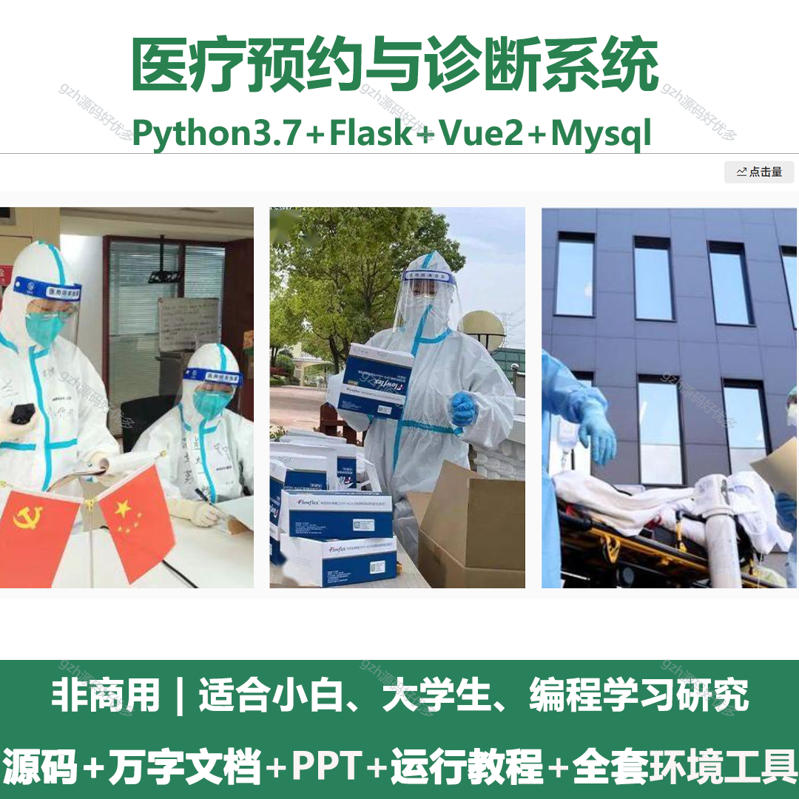
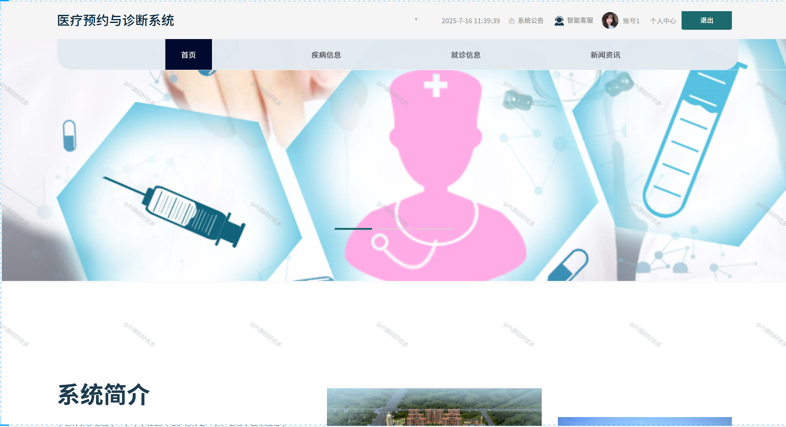
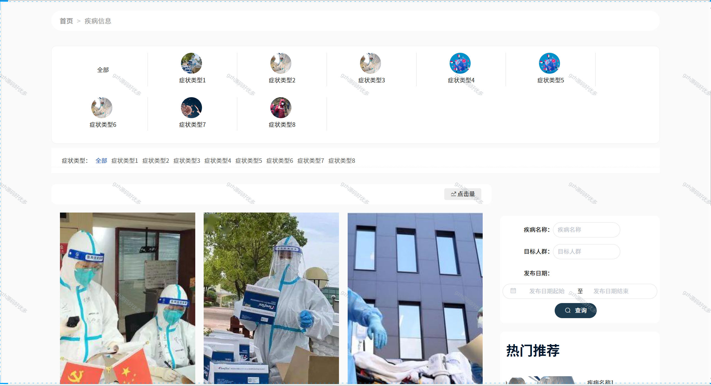
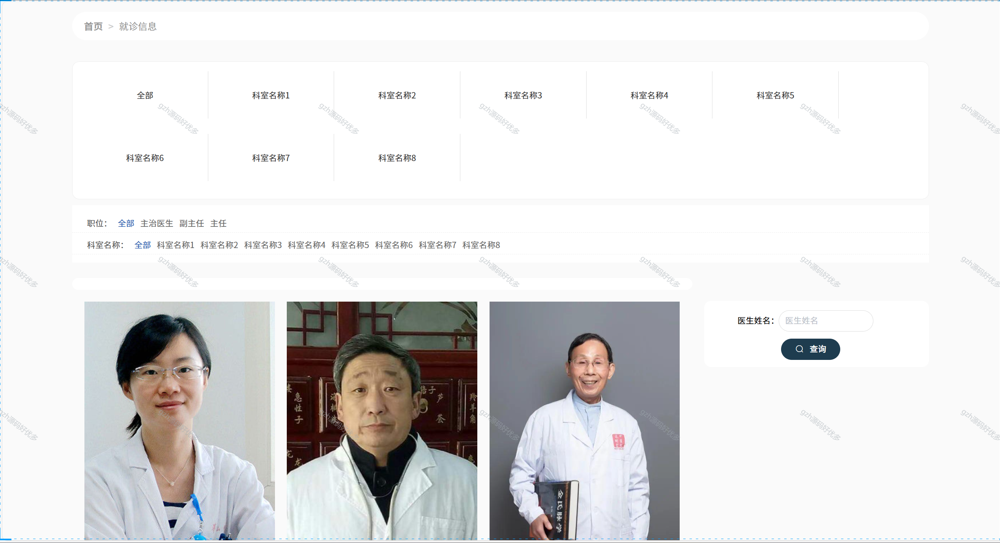
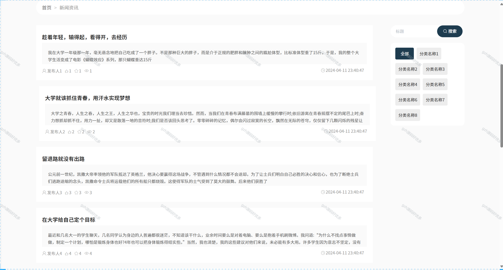
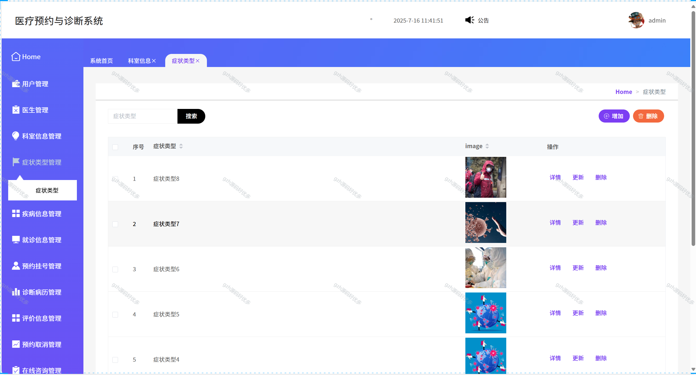
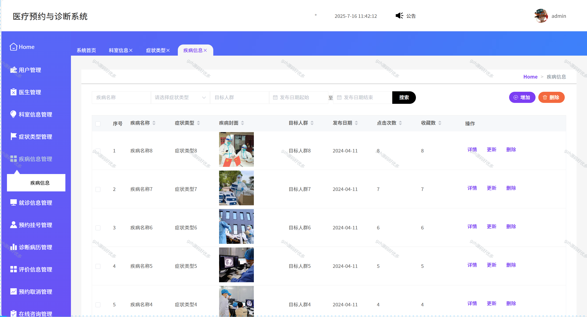
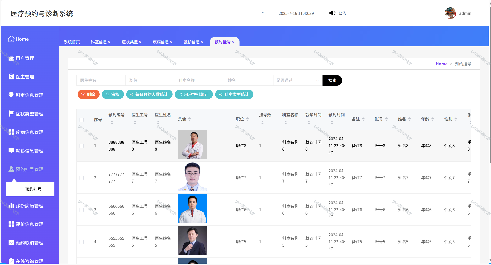
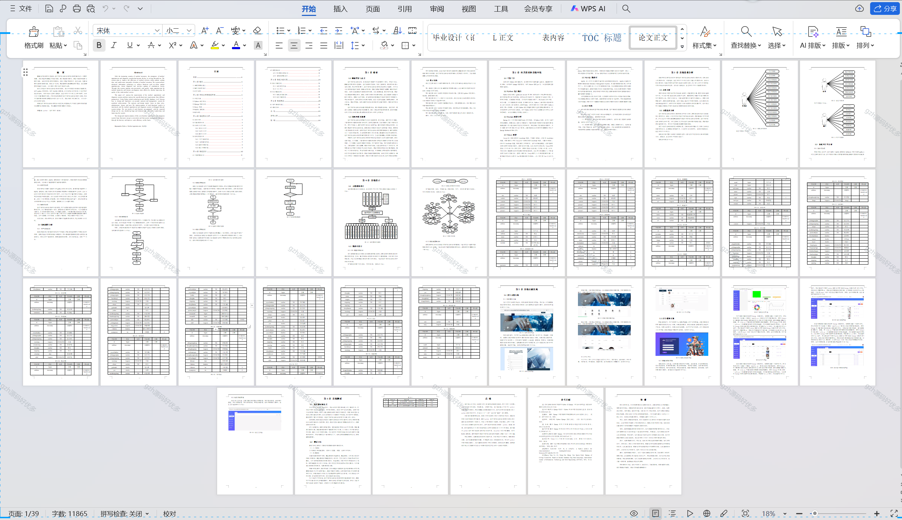

# python059
python059基于Python+Flask的医疗预约与诊断系统+LW+PPT
 
## 查看主页获取源码

### 一、关键词
诊疗预约管理系统，门诊预约与诊断系统，就医预约与诊断平台

### 二、作品包含
源码+数据库+万字文档+PPT+全套环境和工具资源+本地部署教程

### 三、项目技术
前端技术：Vue2.0、Element-ui
后端技术：Python3.7、Flask

### 四、运行环境（以下版本亲测，其他版本未知，请自测）
开发工具：PyCharm + VSCODE

数据库：MySQL5.7（最低要5.7版本）

数据库管理工具：Navicat10+

Python：Python3.7

前端Nodejs：14

浏览器：谷歌浏览器

### 五、项目介绍
项目编号：python059

系统利用先进的信息技术，实现了患者在线预约、医生诊断、检查结果的实时更新等功能。通过这一系统，患者能够方便快捷地预约就诊，医生能够更有效地进行诊断，从而提升了整个医疗服务的品质。
分析和设计主要从管理员、医生和用户三个角色上展开研究，介绍了各个功能模块的实现，并通过系统测试对医疗预约与诊断系统进行调试，将各个功能的测试结果与期望设计进行逐一比对，找出BUG和欠缺之处，从而进一步优化改进系统。

### 六、运行截图

